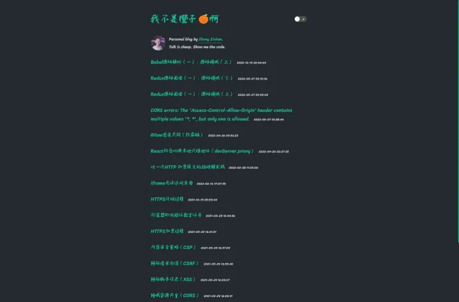

## Getting Started



## Usage

First, build the development server:

```bash
npm run build
# or
yarn build
```
next to run the development server:

```bash
npm run dev
# or
yarn dev
```

next to run the production server:

```bash
npm run start
# or
yarn start
```

Open [http://localhost:3000](http://localhost:3000) with your browser to see the result.
