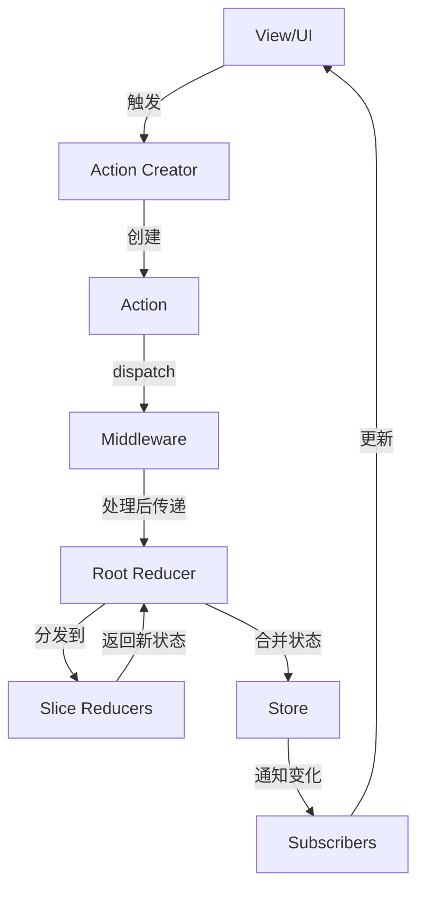
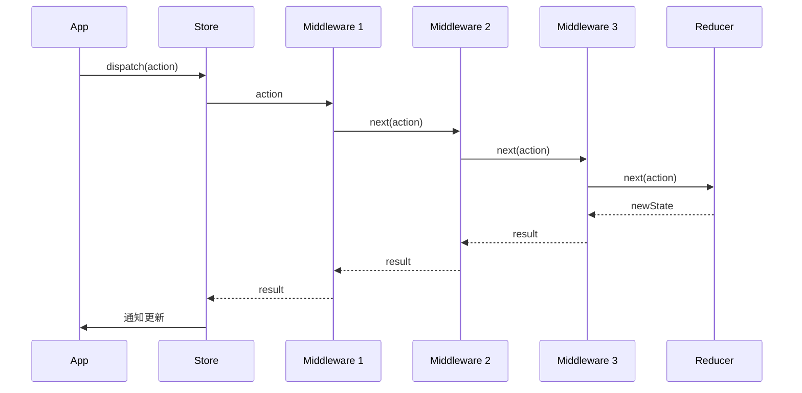
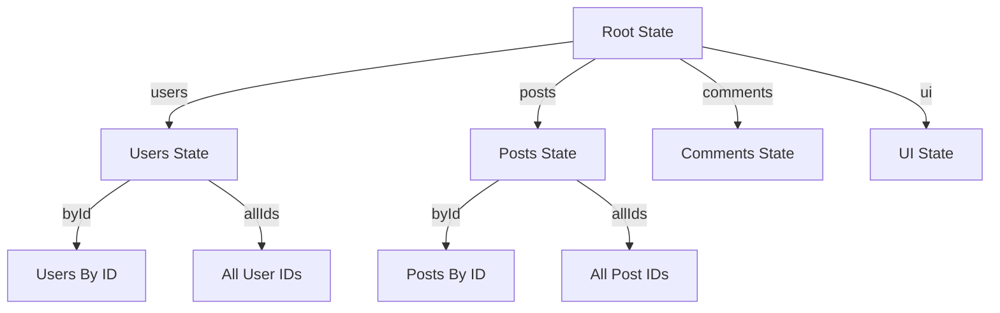

Redux 是一个可预测的状态容器，用于 JavaScript 应用。它可以帮助你编写行为一致、运行于不同环境的应用。Redux 受到 Flux 架构和函数式编程思想的启发，但通过简化和改进了一些概念，使其更易于理解和使用。

## 核心概念

### Store
- 保存整个应用的状态树
- 提供 `getState()` 方法访问状态
- 提供 `dispatch(action)` 方法更新状态
- 提供 `subscribe(listener)` 方法注册监听器
- 是应用中唯一的状态源（单一数据源）

### Action
- 描述发生了什么的普通对象
- 必须包含 `type` 属性
- 是改变状态的唯一方式
- 可以包含任意附加数据
- 通常由 Action Creator 函数创建

### Reducer
- 指定状态如何变化的纯函数
- 接收当前状态和 action，返回新状态
- 必须是纯函数，不能有副作用
- 不能修改现有状态，而是返回新状态
- 可以组合多个 reducer 处理复杂状态

### Middleware
- 提供位于 action 被发起之后、到达 reducer 之前的扩展点
- 可以用来处理异步操作、日志等
- 支持链式调用
- 使用柯里化函数实现
- 可以拦截、修改甚至取消 action

## 核心模块

Redux 的源码主要包含以下核心模块：

`createStore.js`
   - Redux 的核心，创建 store 实例
   - 实现状态管理的主要逻辑
   - 提供 getState、dispatch、subscribe 等方法
   - 支持通过 enhancer 扩展功能

`combineReducers.js`
   - 组合多个 reducer 函数
   - 用于状态的模块化管理
   - 确保每个子 reducer 只处理自己的状态切片
   - 验证 reducer 的合法性

`applyMiddleware.js`
   - 应用中间件的功能
   - 增强 store 的 dispatch 功能
   - 实现中间件的链式调用
   - 是最常用的 store enhancer

`bindActionCreators.js`
   - 把 action creators 转换成直接可以触发的函数
   - 简化 dispatch 调用
   - 保持原始函数的参数和上下文
   - 支持单个函数或对象形式的 action creators

`compose.js`
   - 工具函数，从右到左组合多个函数
   - 用于组合 store enhancers
   - 实现函数式编程中的函数组合
   - 在中间件组合中发挥关键作用

## 内部工具

Redux 内部还包含一些辅助工具：

`actionTypes.js`
   - 定义 Redux 内部使用的 action 类型
   - 包括 INIT、REPLACE 等特殊 action
   - 使用随机字符串防止冲突
   - 用于初始化和替换 reducer

`isPlainObject.js`
   - 检查值是否为普通对象
   - 确保 action 是可序列化的
   - 防止使用类实例等复杂对象

`warning.js`
   - 提供开发环境下的警告信息
   - 帮助开发者发现潜在问题

## 数据流

Redux 采用严格的单向数据流，这使得数据的流动非常清晰可预测：

调用 `store.dispatch(action)`
Redux store 调用传入的 reducer 函数
根 reducer 把多个子 reducer 的结果合并成一个单一的状态树
Redux store 保存 reducer 返回的完整状态树
通知所有订阅者状态发生了变化

## 详细工作流程图

## 中间件执行流程

## 状态树结构

## 最佳实践

使用不可变数据
   - 不直接修改状态
   - 返回新的状态对象
   - 可以使用 Immer 等库简化不可变更新

规范化状态结构
   - 避免嵌套
   - 扁平化数据结构
   - 使用 ID 引用关联数据

使用 Redux Toolkit
   - 官方推荐的工具集
   - 简化 Redux 开发流程
   - 内置 Immer、createSlice 等工具

合理划分 Reducer
   - 按功能模块拆分
   - 使用 combineReducers 组合
   - 保持每个 reducer 的职责单一

有效使用中间件
   - 处理异步操作
   - 添加日志记录
   - 性能优化
   - 常用中间件：redux-thunk、redux-saga

## 性能考虑

避免不必要的状态更新
   - 在 reducer 中比较新旧状态
   - 只在状态真正改变时返回新对象

使用 reselect 进行状态派生
   - 缓存计算结果
   - 避免重复计算
   - 只在依赖变化时重新计算

合理使用 memoization
   - 缓存组件渲染结果
   - 减少不必要的重渲染

优化 reducer 的计算效率
   - 避免深层嵌套的状态
   - 使用高效的数据结构

控制订阅者的数量
   - 避免过多的 subscribe 调用
   - 合理设计组件与 store 的连接

## 调试

Redux DevTools
   - 状态历史记录
   - 时间旅行调试
   - action 记录
   - 状态差异比较

日志中间件
   - 记录 action 和状态变化
   - 便于问题定位
   - 可以条件性启用

错误追踪
   - 使用中间件捕获异常
   - 记录错误上下文

## 扩展性

Redux 通过以下机制提供了良好的扩展性：

Middleware 系统
   - 可插拔的功能扩展
   - 不影响核心逻辑

Store Enhancers
   - 增强 store 的创建过程
   - 可以添加额外功能

Reducer 组合
   - 模块化状态管理
   - 可以动态加载 reducer

Action Creators
   - 封装 action 创建逻辑
   - 支持异步 action

## Redux 与其他库的集成

React-Redux
   - 提供 Provider 和 connect
   - 优化组件更新
   - 提供 hooks API

Redux Toolkit
   - 简化 Redux 使用
   - 提供最佳实践
   - 减少样板代码

Redux-Saga
   - 处理复杂异步流程
   - 基于生成器函数
   - 易于测试

Redux-Observable
   - 基于 RxJS
   - 响应式编程
   - 处理复杂事件流