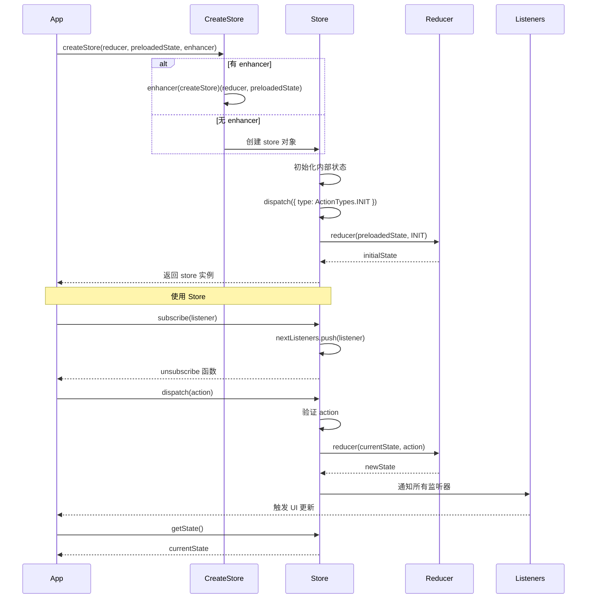
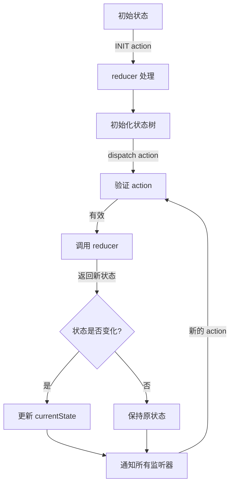
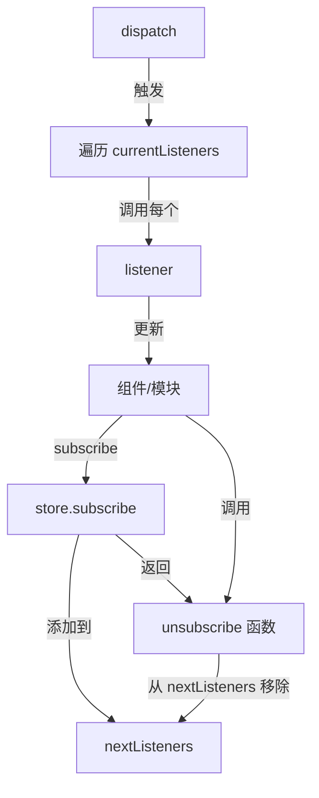

`createStore` 是 Redux 中最核心的 API，用于创建一个 Redux store 来存放应用的所有状态。它实现了状态管理、发布订阅模式和中间件扩展等核心功能。

## 函数签名

```javascript
function createStore(reducer, preloadedState, enhancer)
```

### 参数说明
- `reducer`: (Function) 接收当前 state 和 action，返回新 state 的纯函数
- `preloadedState`: (any) 初始状态，可选
- `enhancer`: (Function) Store enhancer，可选，用于增强 store 功能

### 返回值
- 返回一个 store 对象，包含 `getState`、`dispatch`、`subscribe` 和 `replaceReducer` 方法

## 核心实现分析

### 1. 参数校验与处理

```javascript
if (
  (typeof preloadedState === 'function' && typeof enhancer === 'function') ||
  (typeof enhancer === 'function' && typeof arguments[3] === 'function')
) {
  throw new Error(
    'It looks like you are passing several store enhancers to ' +
    'createStore(). This is not supported. Instead, compose them ' +
    'together to a single function.'
  )
}

if (typeof preloadedState === 'function' && typeof enhancer === 'undefined') {
  enhancer = preloadedState
  preloadedState = undefined
}

if (typeof enhancer !== 'undefined') {
  if (typeof enhancer !== 'function') {
    throw new Error('Expected the enhancer to be a function.')
  }

  return enhancer(createStore)(reducer, preloadedState)
}
```

这段代码主要处理三种情况：
1. 防止传入多个 enhancer（抛出错误）
2. 处理省略 preloadedState 的情况（参数位置调整）
3. 如果提供了 enhancer，则使用它增强 createStore

enhancer 的应用是通过高阶函数实现的：`enhancer(createStore)(reducer, preloadedState)`，这使得 enhancer 可以完全控制 store 的创建过程。

### 2. 内部状态维护

```javascript
let currentReducer = reducer
let currentState = preloadedState
let currentListeners = []
let nextListeners = currentListeners
let isDispatching = false
```

维护了以下内部状态：
- `currentReducer`: 当前的 reducer 函数
- `currentState`: 当前的应用状态
- `currentListeners`: 当前的监听器数组
- `nextListeners`: 下一次 dispatch 时的监听器数组（用于安全修改监听器列表）
- `isDispatching`: 是否正在进行 dispatch（防止在 reducer 执行过程中调用某些方法）

### 3. 监听器列表安全修改

```javascript
function ensureCanMutateNextListeners() {
  if (nextListeners === currentListeners) {
    nextListeners = currentListeners.slice()
  }
}
```

这个函数确保在 dispatch 过程中添加或移除监听器是安全的：
1. 检查 nextListeners 是否与 currentListeners 相同
2. 如果相同，创建 currentListeners 的浅拷贝
3. 这样可以在 dispatch 过程中安全地修改 nextListeners，而不影响当前正在遍历的 currentListeners

### 4. 核心方法：dispatch

```javascript
function dispatch(action) {
  if (!isPlainObject(action)) {
    throw new Error('Actions must be plain objects.')
  }

  if (typeof action.type === 'undefined') {
    throw new Error('Actions may not have an undefined "type" property.')
  }

  if (isDispatching) {
    throw new Error('Reducers may not dispatch actions.')
  }

  try {
    isDispatching = true
    currentState = currentReducer(currentState, action)
  } finally {
    isDispatching = false
  }

  const listeners = (currentListeners = nextListeners)
  for (let i = 0; i < listeners.length; i++) {
    const listener = listeners[i]
    listener()
  }

  return action
}
```

dispatch 方法是 Redux 的核心，它的执行流程：
1. 验证 action 是否为普通对象
2. 确保 action 有 type 属性
3. 防止在 reducer 中调用 dispatch
4. 设置 isDispatching 标志
5. 调用 reducer 计算新状态
6. 重置 isDispatching 标志
7. 更新 currentListeners 为 nextListeners
8. 通知所有监听器
9. 返回原始 action（便于链式调用）

### 5. 订阅机制：subscribe

```javascript
function subscribe(listener) {
  if (typeof listener !== 'function') {
    throw new Error('Expected the listener to be a function.')
  }

  if (isDispatching) {
    throw new Error(
      'You may not call store.subscribe() while the reducer is executing.'
    )
  }

  let isSubscribed = true

  ensureCanMutateNextListeners()
  nextListeners.push(listener)

  return function unsubscribe() {
    if (!isSubscribed) {
      return
    }

    if (isDispatching) {
      throw new Error(
        'You may not unsubscribe from a store listener while the reducer is executing.'
      )
    }

    isSubscribed = false

    ensureCanMutateNextListeners()
    const index = nextListeners.indexOf(listener)
    nextListeners.splice(index, 1)
    currentListeners = null
  }
}
```

subscribe 方法实现了发布-订阅模式：
1. 验证监听器是函数
2. 防止在 reducer 执行过程中订阅
3. 确保可以安全修改 nextListeners
4. 添加监听器到 nextListeners
5. 返回取消订阅的函数，该函数会：
   - 检查是否已取消订阅
   - 防止在 reducer 执行过程中取消订阅
   - 标记已取消订阅
   - 确保可以安全修改 nextListeners
   - 从 nextListeners 中移除监听器
   - 清空 currentListeners 引用

### 6. 状态获取：getState

```javascript
function getState() {
  if (isDispatching) {
    throw new Error(
      'You may not call store.getState() while the reducer is executing.'
    )
  }

  return currentState
}
```

getState 方法很简单，但有两个关键点：
- 防止在 reducer 执行过程中获取状态
- 直接返回 currentState 的引用（而非副本）

### 7. 替换 Reducer：replaceReducer

```javascript
function replaceReducer(nextReducer) {
  if (typeof nextReducer !== 'function') {
    throw new Error('Expected the nextReducer to be a function.')
  }

  currentReducer = nextReducer
  dispatch({ type: ActionTypes.REPLACE })
}
```

replaceReducer 用于热重载和代码分割：
1. 验证新 reducer 是函数
2. 更新 currentReducer 引用
3. 触发特殊的 REPLACE action，使用随机字符串防止冲突
4. 这会导致使用新 reducer 重新计算状态

### 8. 初始化 Store

```javascript
// 初始化 store 时，发送一个特殊的 INIT action
dispatch({ type: ActionTypes.INIT })
```

在 createStore 函数的最后，会自动触发一个特殊的 INIT action：
1. 使用随机字符串作为 type 的一部分，防止冲突
2. 强制 reducer 返回初始状态
3. 填充状态树

## 详细工作流程图



## 状态更新流程



## 订阅机制详解



## 关键特性

1. **状态不可变性**
   - 通过 reducer 返回新状态
   - 不直接修改 currentState
   - 保证状态变化的可追踪性

2. **单一数据源**
   - 所有状态都存储在一个对象中
   - 便于状态管理和调试
   - 简化应用状态的序列化

3. **可预测性**
   - 状态变化只能通过 dispatch action
   - reducer 必须是纯函数
   - 相同的输入总是产生相同的输出

4. **扩展性**
   - 通过 enhancer 扩展 store 功能
   - 支持中间件机制
   - 可以替换 reducer 实现热重载

5. **安全性**
   - 防止在 reducer 执行过程中调用特定方法
   - 安全处理监听器的添加和移除
   - 验证 action 的合法性

## 内部机制详解

### 1. 监听器列表的双缓冲

Redux 使用 currentListeners 和 nextListeners 两个数组实现监听器列表的双缓冲：
- 在 dispatch 过程中使用 currentListeners 通知监听器
- 在添加或移除监听器时修改 nextListeners
- 通过 ensureCanMutateNextListeners 确保安全修改

这种设计解决了在 dispatch 过程中添加或移除监听器可能导致的问题：
- 如果监听器在被调用时添加新监听器，新监听器不会在当前 dispatch 中被调用
- 如果监听器在被调用时移除另一个尚未调用的监听器，被移除的监听器不会被调用

### 2. enhancer 的应用机制

enhancer 的应用采用了函数组合的方式：
```javascript
return enhancer(createStore)(reducer, preloadedState)
```

这种设计允许 enhancer：
1. 接收原始的 createStore 函数
2. 返回一个增强版的 createStore 函数
3. 使用增强版的 createStore 创建 store

这种模式使得 enhancer 可以：
- 在创建 store 前后执行代码
- 修改传递给原始 createStore 的参数
- 增强返回的 store 对象

### 3. 特殊 action 类型

Redux 内部使用了特殊的 action 类型：
- `ActionTypes.INIT`: 初始化 store 时使用
- `ActionTypes.REPLACE`: 替换 reducer 时使用

这些 action 类型使用随机字符串生成，以防止与用户定义的 action 类型冲突：
```javascript
const randomString = () => Math.random().toString(36).substring(7).split('').join('.')
const ActionTypes = {
  INIT: `@@redux/INIT${randomString()}`,
  REPLACE: `@@redux/REPLACE${randomString()}`
}
```

## 使用注意事项

1. **reducer 必须是纯函数**
   - 不修改传入的参数
   - 不执行有副作用的操作
   - 不调用非纯函数

2. **不要在 reducer 中调用 dispatch**
   - 会导致 "Reducers may not dispatch actions" 错误
   - 可能导致无限循环

3. **不要在 reducer 执行过程中获取状态**
   - 会导致 "You may not call store.getState() while the reducer is executing" 错误
   - reducer 已经接收了当前状态作为参数

4. **谨慎处理订阅函数中的异常**
   - 一个监听器中的异常会阻止其他监听器的执行
   - 考虑在监听器中使用 try-catch

5. **避免频繁的订阅和取消订阅**
   - 每次操作都会创建 nextListeners 的副本
   - 可能导致性能问题

6. **理解 getState() 返回的是引用**
   - 不要直接修改 getState() 返回的对象
   - 如需修改，应通过 dispatch action

7. **合理使用 replaceReducer**
   - 主要用于代码分割和热重载
   - 不要在普通业务逻辑中频繁使用