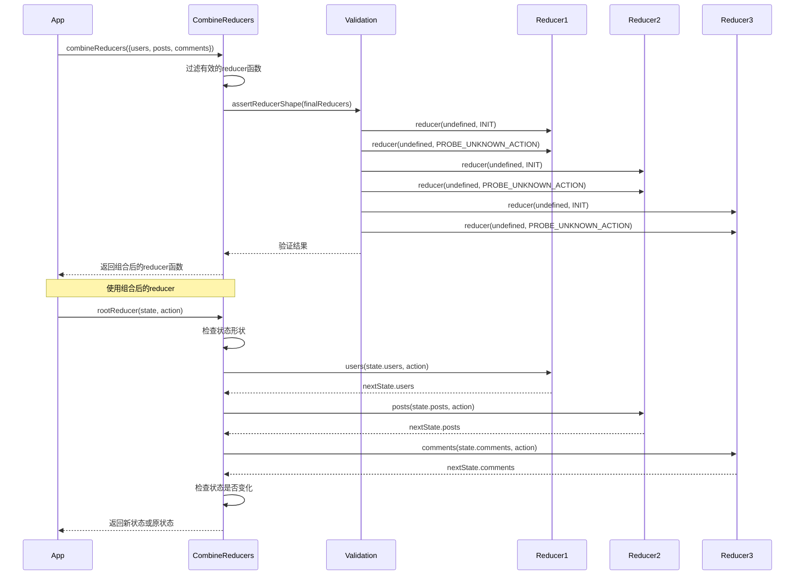
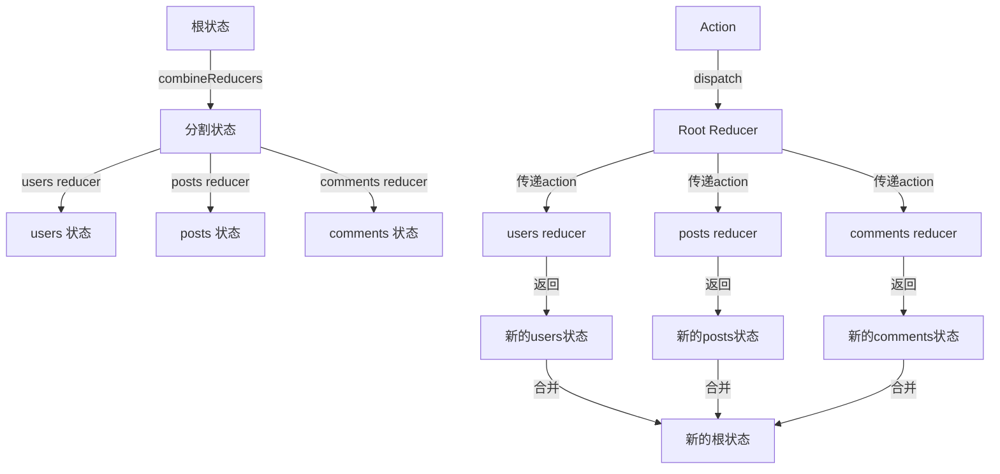

`combineReducers` 是 Redux 中的一个重要工具函数，用于将多个 reducer 函数组合成一个单一的 reducer 函数。这个工具让我们能够将 Redux 应用的状态树按领域分割成多个部分，每个部分由独立的 reducer 函数管理。

## 函数签名

```javascript
function combineReducers(reducers: Object): Function
```

### 参数说明
- `reducers`: 一个对象，其值为不同的 reducer 函数，每个键对应状态树中的一个键

### 返回值
- 返回一个组合后的 reducer 函数，调用每个子 reducer，并将它们的结果合并成一个状态对象

## 核心实现分析

### 1. 预处理 Reducers

```javascript
export default function combineReducers(reducers) {
  const reducerKeys = Object.keys(reducers)
  const finalReducers = {}
  
  for (let i = 0; i < reducerKeys.length; i++) {
    const key = reducerKeys[i]
    
    if (process.env.NODE_ENV !== 'production') {
      if (typeof reducers[key] === 'undefined') {
        warning(`No reducer provided for key "${key}"`)
      }
    }
    
    if (typeof reducers[key] === 'function') {
      finalReducers[key] = reducers[key]
    }
  }
  
  const finalReducerKeys = Object.keys(finalReducers)
  
  // 缓存意外的键，避免重复警告
  let unexpectedKeyCache
  if (process.env.NODE_ENV !== 'production') {
    unexpectedKeyCache = {}
  }
}
```

这段代码主要完成：
1. 获取所有 reducer 的键名
2. 过滤出合法的 reducer 函数（必须是函数类型）
3. 在开发环境下，对未定义的 reducer 发出警告
4. 创建最终的 reducers 对象
5. 初始化意外键的缓存（仅在开发环境）

### 2. Reducer 形状验证

```javascript
function assertReducerShape(reducers) {
  Object.keys(reducers).forEach((key) => {
    const reducer = reducers[key]
    const initialState = reducer(undefined, { type: ActionTypes.INIT })

    if (typeof initialState === 'undefined') {
      throw new Error(
        `The slice reducer for key "${key}" returned undefined during initialization. ` +
        `If the state passed to the reducer is undefined, you must ` +
        `explicitly return the initial state. The initial state may ` +
        `not be undefined. If you don't want to set a value for this reducer, ` +
        `you can use null instead of undefined.`
      )
    }

    if (
      typeof reducer(undefined, {
        type: ActionTypes.PROBE_UNKNOWN_ACTION(),
      }) === 'undefined'
    ) {
      throw new Error(
        `The slice reducer for key "${key}" returned undefined when probed with a random type. ` +
        `Don't try to handle '${ActionTypes.INIT}' or other actions in "redux/*" ` +
        `namespace. They are considered private. Instead, you must return the ` +
        `current state for any unknown actions, unless it is undefined, ` +
        `in which case you must return the initial state, regardless of the ` +
        `action type. The initial state may not be undefined, but can be null.`
      )
    }
  })
}

let shapeAssertionError
try {
  assertReducerShape(finalReducers)
} catch (e) {
  shapeAssertionError = e
}
```

验证每个 reducer 的行为：
1. 检查初始化时是否返回合法的状态（不能是 undefined）
2. 检查处理未知 action 时是否返回当前状态（不能是 undefined）
3. 使用特殊的 INIT 和 PROBE_UNKNOWN_ACTION 类型进行测试
4. 捕获验证过程中的错误，并在后续使用时抛出

这个验证确保了每个 reducer：
- 能够正确初始化自己的状态
- 能够正确处理未知的 action 类型
- 不会返回 undefined 作为状态

### 3. 状态形状验证

```javascript
function getUnexpectedStateShapeWarningMessage(
  inputState,
  reducers,
  action,
  unexpectedKeyCache
) {
  const reducerKeys = Object.keys(reducers)
  const argumentName =
    action && action.type === ActionTypes.INIT
      ? 'preloadedState argument passed to createStore'
      : 'previous state received by the reducer'

  if (reducerKeys.length === 0) {
    return (
      'Store does not have a valid reducer. Make sure the argument passed ' +
      'to combineReducers is an object whose values are reducers.'
    )
  }

  if (!isPlainObject(inputState)) {
    return (
      `The ${argumentName} has unexpected type of "${kindOf(
        inputState
      )}". Expected argument to be an object with the following ` +
      `keys: "${reducerKeys.join('", "')}"`
    )
  }

  const unexpectedKeys = Object.keys(inputState).filter(
    (key) => !reducers.hasOwnProperty(key) && !unexpectedKeyCache[key]
  )

  unexpectedKeys.forEach((key) => {
    unexpectedKeyCache[key] = true
  })

  if (action && action.type === ActionTypes.REPLACE) return

  if (unexpectedKeys.length > 0) {
    return (
      `Unexpected ${unexpectedKeys.length > 1 ? 'keys' : 'key'} ` +
      `"${unexpectedKeys.join('", "')}" found in ${argumentName}. ` +
      `Expected to find one of the known reducer keys instead: ` +
      `"${reducerKeys.join('", "')}". Unexpected keys will be ignored.`
    )
  }
}
```

验证状态对象的结构：
1. 确保有至少一个 reducer
2. 确保状态是普通对象
3. 检查是否存在未知的状态键（不对应任何 reducer）
4. 缓存已警告过的未知键，避免重复警告
5. 对于 REPLACE action，跳过警告
6. 提供详细的警告信息，指出具体的问题

### 4. 组合函数的实现

```javascript
return function combination(state = {}, action) {
  if (shapeAssertionError) {
    throw shapeAssertionError
  }

  if (process.env.NODE_ENV !== 'production') {
    const warningMessage = getUnexpectedStateShapeWarningMessage(
      state,
      finalReducers,
      action,
      unexpectedKeyCache
    )
    if (warningMessage) {
      warning(warningMessage)
    }
  }

  let hasChanged = false
  const nextState = {}
  for (let i = 0; i < finalReducerKeys.length; i++) {
    const key = finalReducerKeys[i]
    const reducer = finalReducers[key]
    const previousStateForKey = state[key]
    const nextStateForKey = reducer(previousStateForKey, action)
    if (typeof nextStateForKey === 'undefined') {
      const actionType = action && action.type
      throw new Error(
        `When called with an action of type ${
          actionType ? `"${String(actionType)}"` : '(unknown type)'
        }, the slice reducer for key "${key}" returned undefined. ` +
        `To ignore an action, you must explicitly return the previous state. ` +
        `If you want this reducer to hold no value, you can return null instead of undefined.`
      )
    }
    nextState[key] = nextStateForKey
    hasChanged = hasChanged || nextStateForKey !== previousStateForKey
  }
  hasChanged =
    hasChanged || finalReducerKeys.length !== Object.keys(state).length
  return hasChanged ? nextState : state
}
```

组合函数的工作流程：
1. 如果之前的形状验证有错误，立即抛出
2. 在开发环境下，检查状态形状并发出警告
3. 遍历所有 reducer 键
4. 对每个键，调用对应的 reducer 处理当前 action
5. 验证 reducer 返回值不是 undefined
6. 收集每个 reducer 的返回值到新状态对象
7. 跟踪状态是否发生变化
8. 如果状态键数量变化，也视为状态变化
9. 只在状态确实改变时返回新状态对象，否则返回原状态

性能优化点：
- 使用 `hasChanged` 标志跟踪状态变化
- 只在状态真正改变时创建新对象
- 保持对象引用稳定，有利于使用引用相等性检查

## 详细工作流程图



## 状态树分割与组合过程



## 关键特性

1. **模块化状态管理**
   - 每个 reducer 管理自己的状态切片
   - 状态树结构与 reducer 结构对应
   - 实现关注点分离

2. **状态完整性检查**
   - 验证 reducer 的合法性
   - 检查状态对象的结构
   - 提供详细的错误和警告信息

3. **性能优化**
   - 只在状态真正改变时返回新对象
   - 缓存未知键的警告
   - 保持对象引用稳定性

4. **开发体验**
   - 详细的错误信息
   - 开发环境下的警告提示
   - 帮助开发者发现潜在问题

## 内部机制详解

### 1. 特殊 Action 类型

combineReducers 使用两种特殊的 action 类型来验证 reducer：

1. `ActionTypes.INIT`：
   - 用于获取 reducer 的初始状态
   - 检查 reducer 是否正确初始化

2. `ActionTypes.PROBE_UNKNOWN_ACTION()`：
   - 生成一个随机的 action 类型
   - 测试 reducer 对未知 action 的处理

这些特殊 action 使用随机字符串生成，以防止与用户定义的 action 冲突。

### 2. 状态变化检测

combineReducers 使用两种方式检测状态变化：

1. 引用相等性检查：
   ```javascript
   hasChanged = hasChanged || nextStateForKey !== previousStateForKey
   ```
   
2. 键数量检查：
   ```javascript
   hasChanged = hasChanged || finalReducerKeys.length !== Object.keys(state).length
   ```

只有当状态确实发生变化时，才会创建新的状态对象，这有助于优化性能。

### 3. 错误处理策略

combineReducers 采用了多层次的错误处理策略：

1. 预验证：在创建组合 reducer 时验证每个 reducer 的行为
2. 运行时验证：在每次调用时检查状态形状
3. 详细错误信息：提供具体的错误原因和位置
4. 开发环境警告：只在开发环境显示某些警告

## 使用最佳实践

1. **状态树设计**
   ```javascript
   const rootReducer = combineReducers({
     users: usersReducer,
     posts: postsReducer,
     comments: commentsReducer
   })
   ```

   状态树结构：
   ```javascript
   {
     users: { /* 由 usersReducer 管理 */ },
     posts: { /* 由 postsReducer 管理 */ },
     comments: { /* 由 commentsReducer 管理 */ }
   }
   ```

2. **Reducer 实现**
   ```javascript
   function usersReducer(state = initialState, action) {
     switch (action.type) {
       case 'USER_ADD':
         return [...state, action.payload]
       default:
         return state
     }
   }
   ```

   关键点：
   - 提供默认状态
   - 处理特定 action 类型
   - 对未知 action 返回当前状态

3. **嵌套的 Reducers**
   ```javascript
   const rootReducer = combineReducers({
     entities: combineReducers({
       users: usersReducer,
       posts: postsReducer
     }),
     ui: uiReducer
   })
   ```

   这会创建嵌套的状态结构：
   ```javascript
   {
     entities: {
       users: { /* ... */ },
       posts: { /* ... */ }
     },
     ui: { /* ... */ }
   }
   ```

4. **动态 Reducers**
   ```javascript
   function createReducer(asyncReducers) {
     return combineReducers({
       users: usersReducer,
       posts: postsReducer,
       ...asyncReducers
     })
   }
   
   // 动态添加 reducer
   store.replaceReducer(createReducer({
     comments: commentsReducer
   }))
   ```

## 注意事项

1. **reducer 必须返回有效的状态值**
   - 不能返回 undefined
   - 可以返回 null 或其他值
   - 必须处理初始状态情况

2. **状态结构与 reducer 结构对应**
   - 每个 reducer 只能访问自己的状态切片
   - 无法直接访问其他 reducer 的状态

3. **处理跨 reducer 的数据依赖**
   - 可以在 action 中包含必要的数据
   - 可以使用选择器组合多个状态切片
   - 可以创建高层次的 reducer 包装 combineReducers

4. **性能考虑**
   - 避免不必要的状态对象创建
   - 在 reducer 中比较新旧状态
   - 使用 Reselect 等库优化派生数据

5. **调试技巧**
   - 使用有意义的状态键名
   - 为每个 reducer 添加日志
   - 使用 Redux DevTools 观察状态变化