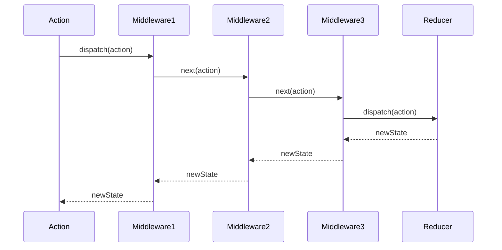
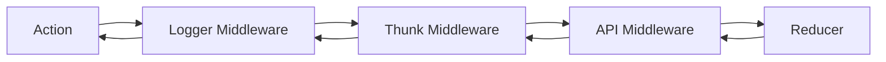

`applyMiddleware` 是 Redux 中的一个重要增强器（enhancer），它允许我们使用自定义的中间件来扩展 Redux 的功能。中间件提供了一个分类点用于在 actions 到达 reducer 之前扩展 Redux 的功能。

## 函数签名

```javascript
function applyMiddleware(...middlewares: Middleware[]): StoreEnhancer
```

### 参数说明
- `...middlewares`: 中间件函数数组，每个中间件都是一个柯里化的函数

### 返回值
- 返回一个 store enhancer 函数

## 核心实现分析

### 基本结构

```javascript
export default function applyMiddleware(...middlewares) {
  return (createStore) => (...args) => {
    const store = createStore(...args)
    // ...
  }
}
```

这是一个三层柯里化的函数：
1. 接收中间件数组
2. 返回一个接收 createStore 的函数
3. 最终返回一个增强后的 store

### 中间件 API 构建

```javascript
let dispatch = () => {
  throw new Error(
    'Dispatching while constructing your middleware is not allowed. ' +
    'Other middleware would not be applied to this dispatch.'
  )
}

const middlewareAPI = {
  getState: store.getState,
  dispatch: (...args) => dispatch(...args)
}
```

为每个中间件提供的 API：
- `getState`: 访问当前状态
- `dispatch`: 动态引用，确保使用最新的 dispatch 函数

### 中间件链组合

```javascript
const chain = middlewares.map((middleware) => middleware(middlewareAPI))
dispatch = compose(...chain)(store.dispatch)
```

中间件的组合过程：
1. 给每个中间件传入 API
2. 使用 compose 函数组合所有中间件
3. 传入原始 dispatch 构建增强版 dispatch

### 返回增强后的 Store

```javascript
return {
  ...store,
  dispatch
}
```

最终返回：
- 保持原有 store 的其他方法不变
- 用增强后的 dispatch 替换原始的 dispatch

## 工作流程图



## 中间件结构图



## 中间件实现示例

### 1. Logger 中间件

```javascript
const logger = store => next => action => {
  console.log('dispatching', action)
  let result = next(action)
  console.log('next state', store.getState())
  return result
}
```

### 2. Thunk 中间件

```javascript
const thunk = store => next => action => {
  if (typeof action === 'function') {
    return action(store.dispatch, store.getState)
  }
  return next(action)
}
```

### 3. Promise 中间件

```javascript
const promise = store => next => action => {
  if (action.then) {
    return Promise.resolve(action).then(store.dispatch)
  }
  return next(action)
}
```

## 关键特性

1. **可组合性**
   - 多个中间件可以组合使用
   - 保持单一职责原则

2. **链式调用**
   - 中间件按顺序执行
   - 每个中间件可以决定是否调用下一个

3. **扩展性**
   - 可以添加任意数量的中间件
   - 中间件可以访问完整的 store API

4. **不可变性**
   - 不修改原始的 action 对象
   - 保持 Redux 数据流的可预测性

## 最佳实践

1. **中间件顺序**
   ```javascript
   const store = createStore(
     reducer,
     applyMiddleware(
       thunk, // 异步操作优先
       logger // 日志记录最后
     )
   )
   ```

2. **错误处理**
   ```javascript
   const errorMiddleware = store => next => action => {
     try {
       return next(action)
     } catch (err) {
       console.error('错误:', err)
       throw err
     }
   }
   ```

3. **性能优化**
   ```javascript
   const perf = store => next => action => {
     const start = performance.now()
     const result = next(action)
     const end = performance.now()
     console.log(`${action.type} 用时: ${end - start}ms`)
     return result
   }
   ```

## 注意事项

1. 中间件执行顺序很重要
2. 避免在中间件构建阶段 dispatch
3. 保持中间件的纯函数特性
4. 注意异步操作的处理
5. 合理使用 getState 和 dispatch

## 调试技巧

1. 使用 Redux DevTools 观察中间件行为
2. 添加日志中间件跟踪 action 流
3. 使用性能中间件监控执行时间
4. 实现错误处理中间件
5. 使用 TypeScript 增强类型安全