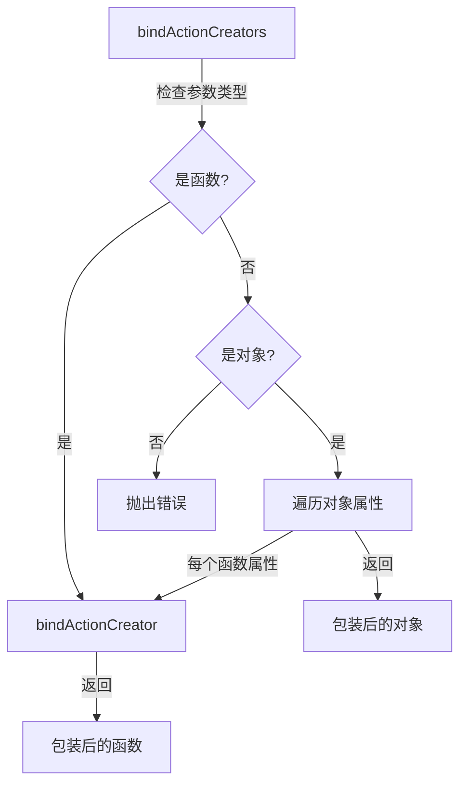

`bindActionCreators` 是 Redux 提供的一个工具函数，它可以将 action creators 转换成直接可以触发 dispatch 的函数，简化了 action 的分发过程。

## 函数签名

```javascript
function bindActionCreators(
  actionCreators: Function | Object,
  dispatch: Function
): Function | Object
```

### 参数说明
- `actionCreators`: action creator 函数或者包含多个 action creator 的对象
- `dispatch`: store 的 dispatch 函数

### 返回值
- 返回与输入结构相同的函数或对象，但每个 action creator 都被包装成可以直接调用 dispatch 的函数

## 核心实现分析

### 单个 Action Creator 的绑定

```javascript
function bindActionCreator(actionCreator, dispatch) {
  return function () {
    return dispatch(actionCreator.apply(this, arguments))
  }
}
```

这个辅助函数实现了：
1. 返回一个新函数
2. 保持原函数的参数和上下文
3. 自动调用 dispatch

### 主函数实现

```javascript
export default function bindActionCreators(actionCreators, dispatch) {
  if (typeof actionCreators === 'function') {
    return bindActionCreator(actionCreators, dispatch)
  }

  if (typeof actionCreators !== 'object' || actionCreators === null) {
    throw new Error(
      `bindActionCreators expected an object or a function, but instead received: '${kindOf(
        actionCreators
      )}'`
    )
  }

  const boundActionCreators = {}
  for (const key in actionCreators) {
    const actionCreator = actionCreators[key]
    if (typeof actionCreator === 'function') {
      boundActionCreators[key] = bindActionCreator(actionCreator, dispatch)
    }
  }
  return boundActionCreators
}
```

主要功能：
1. 处理单个函数的情况
2. 验证参数类型
3. 遍历对象并绑定每个 action creator

## 工作流程图



## 使用示例

### 单个 Action Creator

```javascript
// 原始 action creator
const increment = (amount) => ({
  type: 'INCREMENT',
  payload: amount
})

// 绑定后的函数
const boundIncrement = bindActionCreators(increment, dispatch)

// 使用
boundIncrement(5) // 等同于 dispatch(increment(5))
```

### Action Creators 对象

```javascript
const actionCreators = {
  increment: (amount) => ({
    type: 'INCREMENT',
    payload: amount
  }),
  decrement: (amount) => ({
    type: 'DECREMENT',
    payload: amount
  })
}

const boundActionCreators = bindActionCreators(actionCreators, dispatch)

// 使用
boundActionCreators.increment(5)  // 等同于 dispatch(actionCreators.increment(5))
boundActionCreators.decrement(3)  // 等同于 dispatch(actionCreators.decrement(3))
```

## 实际应用场景

### React 组件中的使用

```javascript
// 不使用 bindActionCreators
class TodoList extends React.Component {
  onAddClick = (text) => {
    this.props.dispatch(addTodo(text))
  }
}

// 使用 bindActionCreators
class TodoList extends React.Component {
  constructor(props) {
    super(props)
    this.boundActionCreators = bindActionCreators(
      { addTodo, removeTodo },
      props.dispatch
    )
  }
}
```

### 与 connect 配合使用

```javascript
import { connect } from 'react-redux'

const mapDispatchToProps = (dispatch) => bindActionCreators({
  increment,
  decrement,
  reset
}, dispatch)

export default connect(mapStateToProps, mapDispatchToProps)(Counter)
```

## 关键特性

1. **自动 Dispatch**
   - 无需手动调用 dispatch
   - 保持原有函数签名

2. **结构保持**
   - 保持原对象的键名
   - 只转换函数类型的值

3. **上下文保持**
   - 通过 apply 保持 this 上下文
   - 传递所有参数

4. **类型检查**
   - 验证输入类型
   - 提供清晰的错误信息

## 最佳实践

1. **组织 Action Creators**
   ```javascript
   // actions/index.js
   export const todoActions = bindActionCreators({
     add: addTodo,
     remove: removeTodo,
     toggle: toggleTodo
   }, store.dispatch)
   ```

2. **组件中使用**
   ```javascript
   // components/TodoList.js
   function TodoList({ actions }) {
     return (
       <button onClick={() => actions.add('New Todo')}>
         Add Todo
       </button>
     )
   }
   ```

3. **模块化管理**
   ```javascript
   const userActions = bindActionCreators(userActionCreators, dispatch)
   const todoActions = bindActionCreators(todoActionCreators, dispatch)
   ```

## 注意事项

1. 不要过度使用
2. 注意内存使用
3. 保持 action creator 的纯函数特性
4. 避免在绑定函数中添加副作用
5. 合理组织 action creators

## 调试建议

1. 使用 Redux DevTools 跟踪 action
2. 添加日志记录绑定过程
3. 检查绑定后的函数名称
4. 验证参数传递
5. 确保 dispatch 正确执行