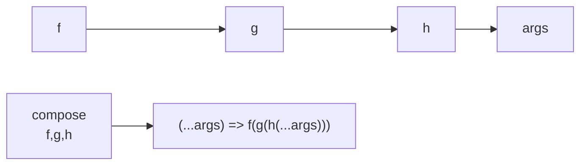
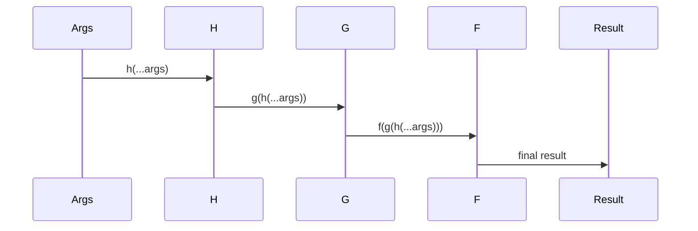

`compose` 是 Redux 中的一个工具函数，用于从右到左组合多个函数。这个函数虽然简单，但是在 Redux 中发挥着重要作用，特别是在中间件的组合过程中。

## 函数签名

```javascript
function compose(...funcs: Function[]): Function
```

### 参数说明
- `...funcs`: 要组合的函数数组

### 返回值
- 返回从右到左组合传入函数后的新函数

## 核心实现分析

### 基本实现

```javascript
export default function compose(...funcs) {
  if (funcs.length === 0) {
    return (arg) => arg
  }

  if (funcs.length === 1) {
    return funcs[0]
  }

  return funcs.reduce((a, b) => (...args) => a(b(...args)))
}
```

实现分析：
1. 处理空函数数组的情况，返回一个透传函数
2. 处理只有一个函数的情况，直接返回该函数
3. 使用 reduce 从右到左组合多个函数

### 组合过程图解



### 执行流程



## 使用示例

### 基本使用

```javascript
const add1 = (x) => x + 1
const multiply2 = (x) => x * 2
const subtract3 = (x) => x - 3

const calculate = compose(
  subtract3,
  multiply2,
  add1
)

console.log(calculate(5))  // ((5 + 1) * 2) - 3 = 9
```

### 在 Redux 中间件中的应用

```javascript
const middleware = compose(
  applyMiddleware(thunk),
  applyMiddleware(logger),
  applyMiddleware(api)
)

const store = createStore(reducer, middleware)
```

## 实现源码解析

### 函数组合过程

```javascript
// 假设有三个函数 f, g, h
const composed = compose(f, g, h)

// 等价于
const composed = (...args) => f(g(h(...args)))

// reduce 的执行过程
// 第一步：组合 f 和 g
const step1 = (...args) => f(g(...args))

// 第二步：组合 step1 和 h
const step2 = (...args) => step1(h(...args))
```

### 数学表示

\[
compose(f, g, h)(x) = f(g(h(x)))
\]

## 性能优化

### 缓存组合结果

```javascript
const memoizedCompose = (...funcs) => {
  const cached = new Map()
  const composedFunc = compose(...funcs)
  
  return (...args) => {
    const key = JSON.stringify(args)
    if (cached.has(key)) {
      return cached.get(key)
    }
    const result = composedFunc(...args)
    cached.set(key, result)
    return result
  }
}
```

### 优化参数传递

```javascript
const optimizedCompose = (...funcs) => {
  if (funcs.length === 0) return (x) => x
  if (funcs.length === 1) return funcs[0]
  
  // 预先创建组合函数
  const composedFunction = funcs.reduce((a, b) => (...args) => a(b(...args)))
  
  return composedFunction
}
```

## 实际应用场景

### 中间件组合

```javascript
const enhancer = compose(
  applyMiddleware(thunk),
  applyMiddleware(logger),
  DevTools.instrument()
)
```

### 数据转换

```javascript
const processUser = compose(
  normalizeData,
  validateUser,
  enrichUserData
)
```

### 高阶组件组合

```javascript
const enhance = compose(
  withRouter,
  connect(mapState, mapDispatch),
  withStyles(styles)
)
```

## 关键特性

1. **函数式编程**
   - 支持函数组合
   - 保持数据流的清晰性

2. **不可变性**
   - 不修改原始函数
   - 返回新的组合函数

3. **灵活性**
   - 支持任意数量的函数
   - 支持不同类型的函数组合

4. **可预测性**
   - 确定的执行顺序
   - 清晰的数据流向

## 最佳实践

1. **函数组合顺序**
   ```javascript
   const enhance = compose(
     last,
     middle,
     first
   )
   ```

2. **错误处理**
   ```javascript
   const safeCompose = (...funcs) => {
     return (...args) => {
       try {
         return compose(...funcs)(...args)
       } catch (error) {
         console.error('Composition error:', error)
         return args
       }
     }
   }
   ```

3. **类型检查**
   ```javascript
   const typeCheckedCompose = (...funcs) => {
     funcs.forEach(fn => {
       if (typeof fn !== 'function') {
         throw new Error('Compose requires functions as arguments')
       }
     })
     return compose(...funcs)
   }
   ```

## 注意事项

1. 注意函数组合的顺序
2. 确保每个函数都返回合适的值
3. 避免副作用
4. 保持函数的纯度
5. 合理处理错误情况

## 调试技巧

1. 使用日志跟踪函数执行
2. 添加函数名称以便调试
3. 使用断点调试组合过程
4. 验证中间结果
5. 测试边界情况