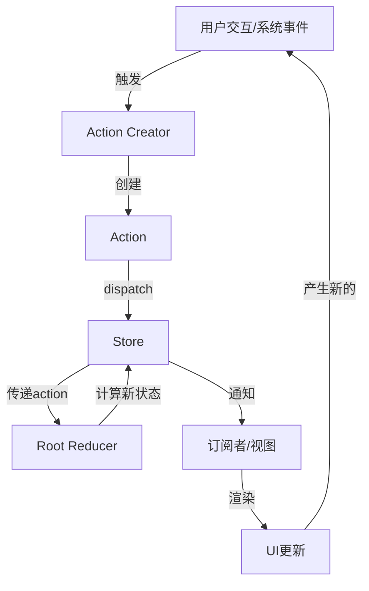
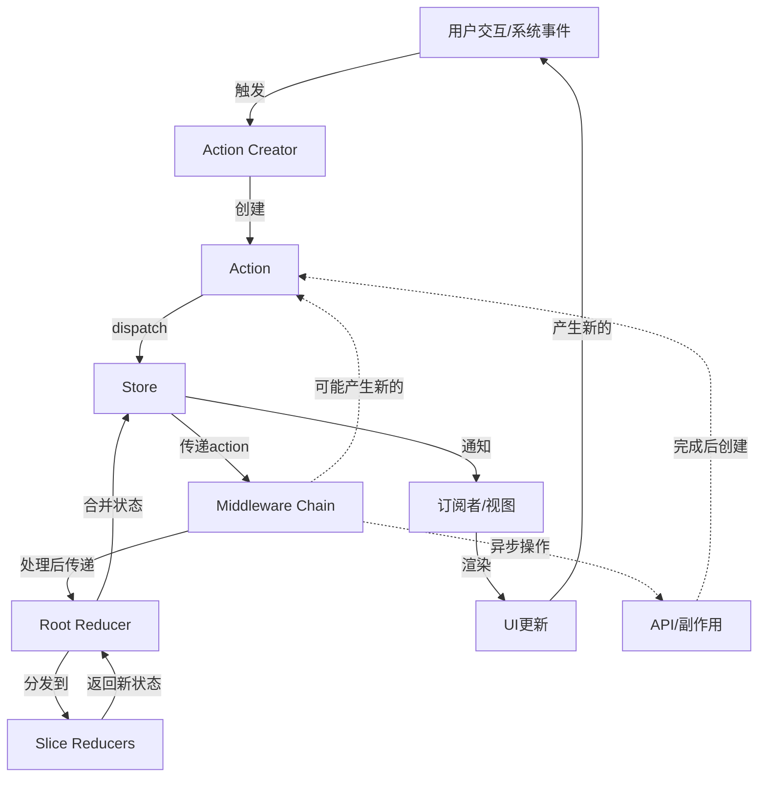
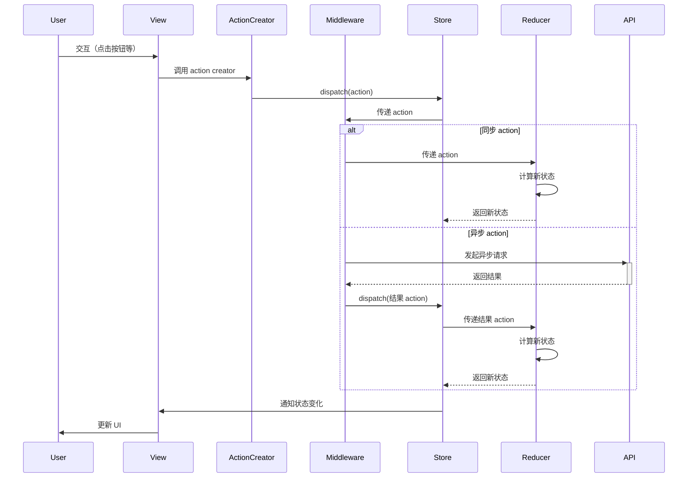
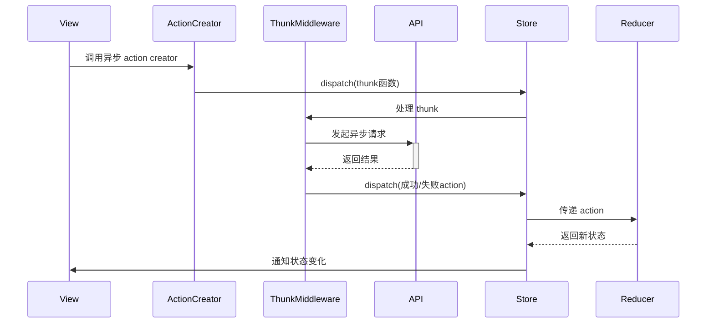
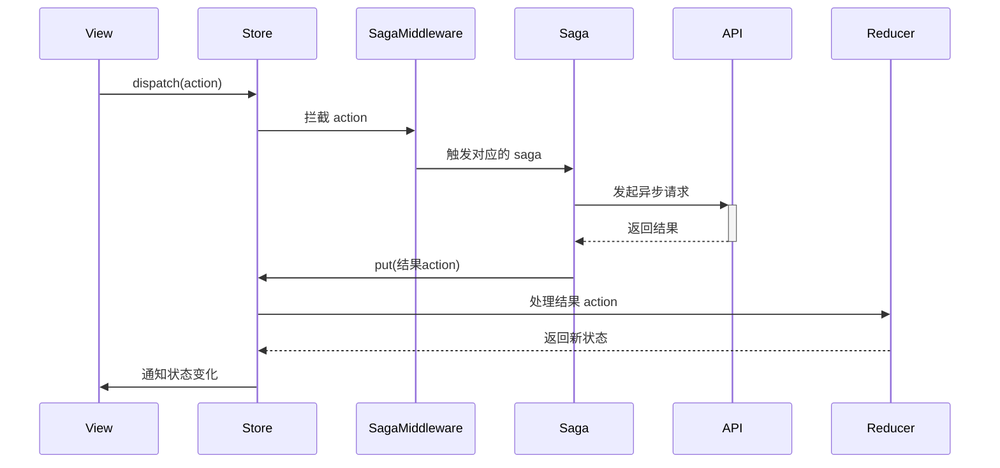
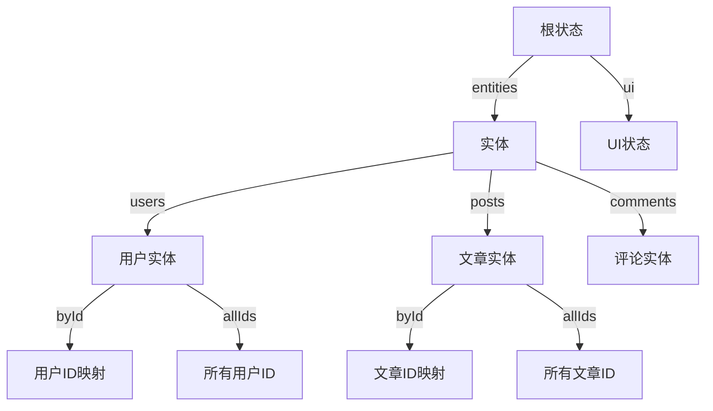
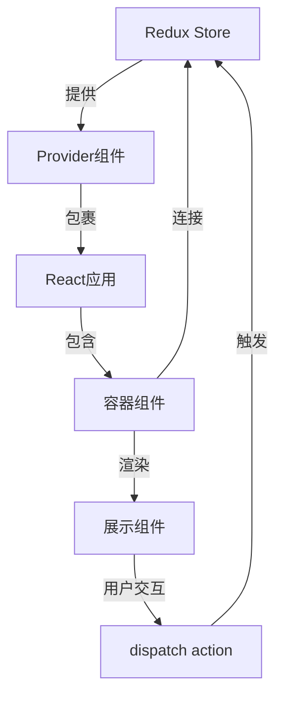
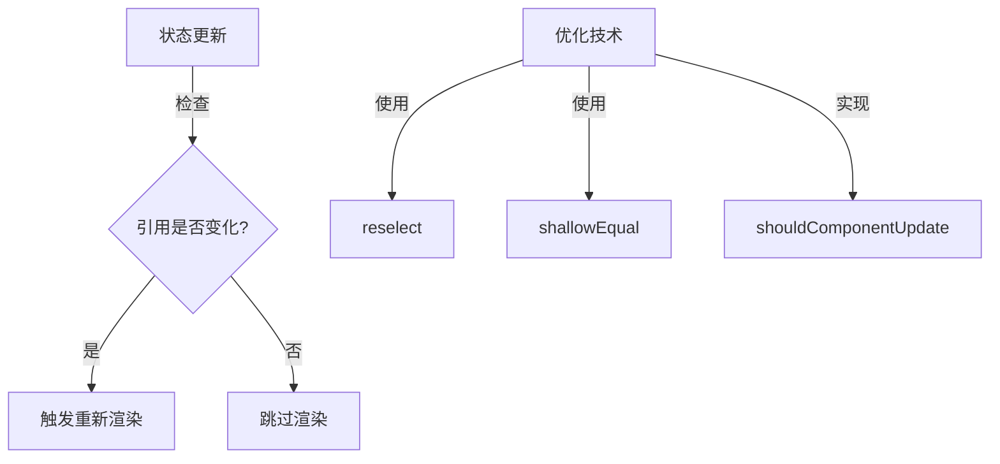
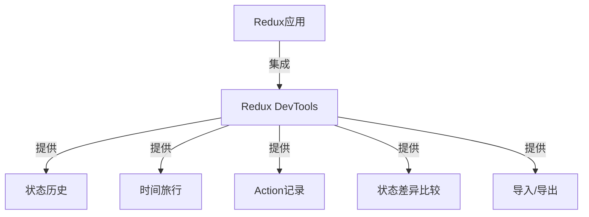
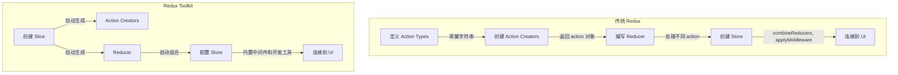

Redux 是一个可预测的状态容器，它通过严格的单向数据流和纯函数来管理应用状态。本文档详细描述了 Redux 的完整工作流程，包括各个核心组件之间的交互和数据流动。

## 核心工作流程

Redux 的工作流程遵循严格的单向数据流模式，主要包括以下步骤：

1. **用户交互或系统事件触发 action**
2. **dispatch 将 action 发送到 store**
3. **store 将 action 传递给 reducer**
4. **reducer 根据 action 计算新状态**
5. **store 更新状态并通知订阅者**
6. **视图层响应状态变化并更新 UI**

## 详细流程图

### 基本数据流



### 包含中间件的完整流程



### 时序图



## 组件交互详解

### 1. Action 与 Action Creator

Action 是描述发生了什么的普通 JavaScript 对象，必须包含 `type` 属性。Action Creator 是创建 action 的函数。

```javascript
// Action 对象
{
  type: 'ADD_TODO',
  text: '学习 Redux'
}

// Action Creator
function addTodo(text) {
  return {
    type: 'ADD_TODO',
    text
  }
}
```

Action 可以分为两类：
- **同步 Action**：普通对象，立即被处理
- **异步 Action**：通过中间件处理，如函数（redux-thunk）或 Promise（redux-promise）

### 2. Store 与 Dispatch

Store 是保存状态的对象，通过 `createStore` 创建。`dispatch` 是触发状态更新的唯一方法。

```javascript
import { createStore } from 'redux'
import rootReducer from './reducers'

const store = createStore(rootReducer)
store.dispatch(addTodo('学习 Redux'))
```

Dispatch 流程：
1. 接收 action 对象
2. 检查 action 合法性
3. 调用 reducer 计算新状态
4. 更新 store 中的状态
5. 通知所有订阅者

### 3. Reducer 与状态计算

Reducer 是纯函数，接收当前状态和 action，返回新状态。

```javascript
function todoReducer(state = [], action) {
  switch (action.type) {
    case 'ADD_TODO':
      return [...state, { text: action.text, completed: false }]
    default:
      return state
  }
}
```

Reducer 处理流程：
1. 接收当前状态和 action
2. 根据 action.type 确定如何处理
3. 不修改原状态，返回新状态对象
4. 对未知 action 返回原状态

### 4. 中间件与增强功能

中间件提供了扩展 dispatch 的方式，可以处理异步操作、日志记录等。

```javascript
import { createStore, applyMiddleware } from 'redux'
import thunk from 'redux-thunk'
import logger from 'redux-logger'
import rootReducer from './reducers'

const store = createStore(
  rootReducer,
  applyMiddleware(thunk, logger)
)
```

中间件执行流程：
1. `dispatch` 被调用，action 进入中间件链
2. 每个中间件可以：
   - 检查 action
   - 传递给下一个中间件
   - 转换 action
   - 阻止 action 继续传递
   - 分发新的 action
3. 最后一个中间件将 action 传给 reducer

### 5. 订阅与通知机制

Store 提供 `subscribe` 方法注册监听器，在状态变化时通知它们。

```javascript
const unsubscribe = store.subscribe(() => {
  console.log('状态已更新:', store.getState())
})

// 取消订阅
unsubscribe()
```

订阅机制流程：
1. 组件通过 `subscribe` 注册监听函数
2. 状态更新后，store 遍历所有监听器并调用
3. 监听器可以通过 `getState()` 获取最新状态
4. 组件可以通过返回的函数取消订阅

## 异步数据流

Redux 本身只处理同步数据流。处理异步操作需要中间件，最常用的是 redux-thunk 和 redux-saga。

### Redux Thunk 工作流程



### Redux Saga 工作流程



## 状态规范化

在复杂应用中，状态通常需要规范化，类似关系型数据库的结构。



规范化状态示例：

```javascript
{
  entities: {
    users: {
      byId: {
        "user1": { id: "user1", name: "张三" },
        "user2": { id: "user2", name: "李四" }
      },
      allIds: ["user1", "user2"]
    },
    posts: {
      byId: {
        "post1": { id: "post1", title: "Redux教程", authorId: "user1" }
      },
      allIds: ["post1"]
    }
  },
  ui: {
    loading: false,
    currentUserId: "user1"
  }
}
```

## 与 React 集成

Redux 通常与 React 一起使用，通过 react-redux 库连接。

### 连接流程



### 使用 connect

```javascript
import { connect } from 'react-redux'

// 将 state 映射到 props
const mapStateToProps = (state) => ({
  todos: state.todos
})

// 将 dispatch 映射到 props
const mapDispatchToProps = (dispatch) => ({
  addTodo: (text) => dispatch(addTodo(text))
})

// 连接组件
export default connect(mapStateToProps, mapDispatchToProps)(TodoApp)
```

### 使用 Hooks

```javascript
import { useSelector, useDispatch } from 'react-redux'
import { addTodo } from './actions'

function TodoApp() {
  const todos = useSelector(state => state.todos)
  const dispatch = useDispatch()
  
  return (
    <div>
      <button onClick={() => dispatch(addTodo('新任务'))}>
        添加任务
      </button>
      <ul>
        {todos.map(todo => (
          <li key={todo.id}>{todo.text}</li>
        ))}
      </ul>
    </div>
  )
}
```

## 性能优化

Redux 应用的性能优化主要集中在以下几个方面：

### 1. 减少不必要的渲染



### 2. 高效的状态更新

```javascript
// 不推荐 - 直接修改
state.users[0].name = '新名字'

// 推荐 - 不可变更新
return {
  ...state,
  users: [
    { ...state.users[0], name: '新名字' },
    ...state.users.slice(1)
  ]
}

// 使用 Immer
import produce from 'immer'

return produce(state, draft => {
  draft.users[0].name = '新名字'
})
```

### 3. 批量更新

```javascript
// 不推荐 - 多次独立 dispatch
dispatch(action1)
dispatch(action2)
dispatch(action3)

// 推荐 - 批量 action
dispatch(batchActions([action1, action2, action3]))
```

## 调试与开发工具

Redux 提供了强大的调试能力，主要通过 Redux DevTools 实现。



集成 Redux DevTools：

```javascript
import { createStore, applyMiddleware, compose } from 'redux'
import rootReducer from './reducers'

const composeEnhancers = window.__REDUX_DEVTOOLS_EXTENSION_COMPOSE__ || compose
const store = createStore(
  rootReducer,
  composeEnhancers(applyMiddleware(...middleware))
)
```

## 最佳实践总结

1. **保持状态最小化**：只存储必要的数据
2. **规范化状态结构**：避免嵌套，使用 ID 引用
3. **使用选择器获取数据**：封装状态访问逻辑
4. **使用 Redux Toolkit**：减少样板代码
5. **合理拆分 reducer**：按领域划分
6. **谨慎使用中间件**：只添加必要的中间件
7. **编写测试**：测试 action creators、reducers 和选择器
8. **使用不可变更新模式**：考虑使用 Immer
9. **遵循 Redux 风格指南**：保持代码一致性
10. **使用 TypeScript**：增强类型安全

## 总结

Redux 的工作流程是一个严格的单向数据流，确保了状态变化的可预测性和可追踪性。通过理解这个流程，我们可以更好地设计和实现 Redux 应用，处理复杂的状态管理需求。

关键点回顾：

1. **单向数据流**：数据沿着一个方向流动，从 action 到 reducer，再到 store，最后到视图
2. **不可变性**：状态不直接修改，而是通过创建新对象来表示变化
3. **纯函数**：reducer 是纯函数，确保状态变化的可预测性
4. **中间件**：处理副作用和异步操作的扩展点
5. **与 React 集成**：通过 Provider 和 connect/hooks 将 Redux 与 React 组件连接

通过遵循这些原则和流程，Redux 帮助我们构建可维护、可测试和可预测的应用程序。

## Redux Toolkit 与传统 Redux 的工作流程对比

随着 Redux 的发展，官方推出了 Redux Toolkit (RTK) 来简化 Redux 开发。虽然 RTK 简化了 API，但底层仍然遵循相同的 Redux 工作流程。下面我们对比传统 Redux 和 Redux Toolkit 的工作流程。

### 传统 Redux vs Redux Toolkit



### 主要区别

#### 1. Action 定义

**传统 Redux**:
```javascript
// 定义 action types
const ADD_TODO = 'ADD_TODO'
const TOGGLE_TODO = 'TOGGLE_TODO'

// 创建 action creators
function addTodo(text) {
  return { type: ADD_TODO, payload: text }
}

function toggleTodo(id) {
  return { type: TOGGLE_TODO, payload: id }
}
```

**Redux Toolkit**:
```javascript
// 使用 createSlice 自动生成 action types 和 action creators
const todosSlice = createSlice({
  name: 'todos',
  initialState: [],
  reducers: {
    addTodo: (state, action) => {
      state.push({ id: Date.now(), text: action.payload, completed: false })
    },
    toggleTodo: (state, action) => {
      const todo = state.find(todo => todo.id === action.payload)
      if (todo) {
        todo.completed = !todo.completed
      }
    }
  }
})

// 自动生成的 action creators
export const { addTodo, toggleTodo } = todosSlice.actions
```

#### 2. Reducer 实现

**传统 Redux**:
```javascript
// 手动实现 reducer，保持不可变性
function todosReducer(state = [], action) {
  switch (action.type) {
    case ADD_TODO:
      return [
        ...state,
        { id: Date.now(), text: action.payload, completed: false }
      ]
    case TOGGLE_TODO:
      return state.map(todo =>
        todo.id === action.payload
          ? { ...todo, completed: !todo.completed }
          : todo
      )
    default:
      return state
  }
}
```

**Redux Toolkit**:
```javascript
// 在 createSlice 中定义 reducer，内置 Immer 支持"可变"更新
const todosSlice = createSlice({
  name: 'todos',
  initialState: [],
  reducers: {
    addTodo: (state, action) => {
      // 看起来是直接修改，但实际上 Immer 会处理不可变更新
      state.push({ id: Date.now(), text: action.payload, completed: false })
    },
    toggleTodo: (state, action) => {
      const todo = state.find(todo => todo.id === action.payload)
      if (todo) {
        todo.completed = !todo.completed
      }
    }
  }
})

// 导出生成的 reducer
export default todosSlice.reducer
```

#### 3. Store 配置

**传统 Redux**:
```javascript
import { createStore, combineReducers, applyMiddleware } from 'redux'
import thunk from 'redux-thunk'
import { composeWithDevTools } from 'redux-devtools-extension'
import todosReducer from './reducers/todos'
import filtersReducer from './reducers/filters'

const rootReducer = combineReducers({
  todos: todosReducer,
  filters: filtersReducer
})

const store = createStore(
  rootReducer,
  composeWithDevTools(applyMiddleware(thunk))
)

export default store
```

**Redux Toolkit**:
```javascript
import { configureStore } from '@reduxjs/toolkit'
import todosReducer from './features/todos/todosSlice'
import filtersReducer from './features/filters/filtersSlice'

const store = configureStore({
  reducer: {
    todos: todosReducer,
    filters: filtersReducer
  }
  // 自动配置 Redux DevTools 和常用中间件
})

export default store
```

#### 4. 异步操作

**传统 Redux (使用 redux-thunk)**:
```javascript
// 异步 action creator
function fetchTodos() {
  return async function(dispatch) {
    dispatch({ type: 'FETCH_TODOS_REQUEST' })
    
    try {
      const response = await fetch('/api/todos')
      const data = await response.json()
      dispatch({ type: 'FETCH_TODOS_SUCCESS', payload: data })
    } catch (error) {
      dispatch({ type: 'FETCH_TODOS_FAILURE', error })
    }
  }
}
```

**Redux Toolkit**:
```javascript
import { createAsyncThunk, createSlice } from '@reduxjs/toolkit'

// 创建异步 thunk
export const fetchTodos = createAsyncThunk(
  'todos/fetchTodos',
  async () => {
    const response = await fetch('/api/todos')
    return response.json()
  }
)

const todosSlice = createSlice({
  name: 'todos',
  initialState: { items: [], status: 'idle', error: null },
  reducers: {
    // 同步 reducers
  },
  extraReducers: (builder) => {
    // 处理异步 action 的状态
    builder
      .addCase(fetchTodos.pending, (state) => {
        state.status = 'loading'
      })
      .addCase(fetchTodos.fulfilled, (state, action) => {
        state.status = 'succeeded'
        state.items = action.payload
      })
      .addCase(fetchTodos.rejected, (state, action) => {
        state.status = 'failed'
        state.error = action.error.message
      })
  }
})
```

### 工作流程对比

虽然 API 不同，但底层工作流程仍然相似：

1. **Action 分发**：无论是传统 Redux 还是 Redux Toolkit，都使用 `dispatch` 来分发 action
2. **Reducer 处理**：两者都使用 reducer 来计算新状态，只是 RTK 使用 Immer 简化了不可变更新
3. **Store 更新**：两者都通过 store 来保存状态并通知订阅者
4. **UI 更新**：两者都可以使用 react-redux 的 `connect` 或 hooks API 连接到 React 组件

### Redux Toolkit 的优势

1. **减少样板代码**：自动生成 action types 和 action creators
2. **简化不可变更新**：内置 Immer 库，允许"直接修改"状态
3. **默认最佳实践**：内置 Redux DevTools 和常用中间件
4. **统一异步处理**：createAsyncThunk 简化异步操作
5. **类型安全**：更好的 TypeScript 支持

### 何时使用 Redux Toolkit

- **新项目**：对于新的 Redux 项目，推荐使用 Redux Toolkit
- **现有项目**：可以逐步迁移到 Redux Toolkit
- **学习目的**：理解传统 Redux 有助于更好地理解 Redux Toolkit

无论使用传统 Redux 还是 Redux Toolkit，理解本文档中描述的 Redux 核心工作流程都是非常重要的，因为这些基本原则在两者中都是一致的。