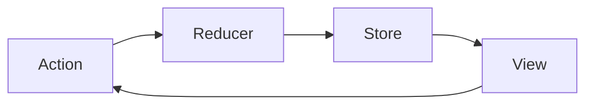

Redux 不仅是一个状态管理库，它还体现了多种软件设计模式和架构思想。通过分析 Redux 的源码和示例，我们可以深入理解这些设计理念，并将其应用到自己的项目中。

## 核心设计模式

### 单向数据流 (Unidirectional Data Flow)

Redux 最核心的设计模式是单向数据流，这种模式确保了数据在应用中的流动是可预测的。



**实现方式**：
- 状态只能通过 dispatch action 来更新
- reducer 是纯函数，根据当前状态和 action 计算新状态
- 视图订阅 store 的变化，并相应地更新

**优势**：
- 状态变化可追踪
- 调试简单
- 数据流向清晰

### 命令模式 (Command Pattern)

Action 在 Redux 中实现了命令模式，它将"意图"封装成对象。

```javascript
// 命令对象
const addTodoAction = {
  type: 'ADD_TODO',
  text: '学习设计模式'
}

// 命令执行者
store.dispatch(addTodoAction)
```

**实现方式**：
- action 是描述"意图"的普通对象
- action creator 是创建 action 的工厂函数
- store.dispatch 方法执行这些命令

**优势**：
- 解耦命令的创建和执行
- 便于序列化和记录
- 支持撤销/重做功能

### 观察者模式 (Observer Pattern)

Redux 的订阅机制实现了观察者模式，允许组件订阅状态变化。

```javascript
// 订阅状态变化
const unsubscribe = store.subscribe(() => {
  console.log('状态已更新:', store.getState())
})

// 取消订阅
unsubscribe()
```

**实现方式**：
- store 维护一个监听器列表
- subscribe 方法添加监听器
- dispatch 方法通知所有监听器
- 返回取消订阅的函数

**优势**：
- 组件与状态管理解耦
- 支持多个观察者
- 状态变化时自动通知

### 中介者模式 (Mediator Pattern)

Store 在 Redux 中充当中介者，协调 action、reducer 和视图之间的交互。

```javascript
const store = createStore(reducer)
```

**实现方式**：
- store 接收 action 并传递给 reducer
- store 保存 reducer 返回的新状态
- store 通知所有订阅者状态已更新

**优势**：
- 集中管理状态
- 简化组件间通信
- 降低系统耦合度

### 装饰器模式 (Decorator Pattern)

Redux 中间件和 enhancer 实现了装饰器模式，用于增强 store 的功能。

```javascript
const store = createStore(
  reducer,
  applyMiddleware(logger, thunk)
)
```

**实现方式**：
- 中间件包装 dispatch 方法
- enhancer 包装 createStore 函数
- compose 函数组合多个增强器

**优势**：
- 不修改原始代码的情况下扩展功能
- 支持功能的组合和排序
- 保持单一职责原则

### 组合模式 (Composite Pattern)

combineReducers 实现了组合模式，将多个 reducer 组合成一个。

```javascript
const rootReducer = combineReducers({
  todos: todosReducer,
  visibilityFilter: visibilityFilterReducer
})
```

**实现方式**：
- 每个 reducer 管理状态树的一部分
- combineReducers 创建一个调用所有 reducer 的函数
- 组合后的 reducer 保持与单个 reducer 相同的接口

**优势**：
- 模块化状态管理
- 关注点分离
- 可组合性

### 工厂模式 (Factory Pattern)

createStore 函数实现了工厂模式，用于创建 store 实例。

```javascript
const store = createStore(reducer, preloadedState, enhancer)
```

**实现方式**：
- createStore 函数封装了 store 的创建逻辑
- 接受不同的参数创建定制的 store
- 返回具有统一接口的 store 对象

**优势**：
- 封装复杂的创建逻辑
- 提供统一的接口
- 支持扩展和定制

## 架构思想

### 函数式编程 (Functional Programming)

Redux 大量采用函数式编程思想，特别是在 reducer 和中间件的实现上。

**核心原则**：
- **纯函数**：reducer 是纯函数，对于相同的输入总是返回相同的输出
- **不可变性**：不直接修改状态，而是返回新的状态对象
- **函数组合**：使用 compose 函数组合多个函数
- **高阶函数**：中间件和 enhancer 都是高阶函数

**示例**：
```javascript
// 纯函数
function counter(state = 0, action) {
  switch (action.type) {
    case 'INCREMENT':
      return state + 1
    default:
      return state
  }
}

// 函数组合
const enhancer = compose(
  applyMiddleware(thunk),
  DevTools.instrument()
)
```

### CQRS (命令查询责任分离)

Redux 实现了 CQRS 模式的简化版本，将状态的读取和修改分开。

**实现方式**：
- **命令**：通过 dispatch(action) 修改状态
- **查询**：通过 getState() 读取状态

**优势**：
- 清晰的责任划分
- 简化状态管理
- 提高可测试性

### 事件溯源 (Event Sourcing)

Redux 的 action 日志可以看作是事件溯源模式的一种实现。

**实现方式**：
- action 代表系统中发生的事件
- 当前状态是所有 action 的累积结果
- 可以通过重放 action 重建状态

**优势**：
- 完整的审计跟踪
- 支持时间旅行调试
- 状态可重建

### 依赖注入 (Dependency Injection)

Redux 通过 Provider 和 connect 实现了一种依赖注入模式。

```javascript
// 提供 store
<Provider store={store}>
  <App />
</Provider>

// 注入依赖
connect(mapStateToProps, mapDispatchToProps)(Component)
```

**实现方式**：
- Provider 组件通过 React Context 提供 store
- connect 函数从 Context 中获取 store
- 将 state 和 dispatch 映射到组件 props

**优势**：
- 组件不直接依赖 store
- 便于测试和复用
- 降低组件间耦合

## 实际应用中的设计模式

通过分析 Redux 示例代码，我们可以看到这些设计模式是如何在实际应用中使用的：

### 计数器示例 (Counter)

最简单的示例展示了单向数据流和命令模式：

```javascript
// 单向数据流
const render = () => ReactDOM.render(
  <Counter
    value={store.getState()}
    onIncrement={() => store.dispatch({ type: 'INCREMENT' })}
    onDecrement={() => store.dispatch({ type: 'DECREMENT' })}
  />,
  rootEl
)

// 命令模式
store.dispatch({ type: 'INCREMENT' })
```

### 待办事项示例 (Todos)

展示了组合模式和工厂模式：

```javascript
// 组合模式
const rootReducer = combineReducers({
  todos,
  visibilityFilter
})

// 工厂模式
const store = createStore(rootReducer)
```

### 异步示例 (Async)

展示了装饰器模式和观察者模式：

```javascript
// 装饰器模式
const middleware = [ thunk ]
if (process.env.NODE_ENV !== 'production') {
  middleware.push(createLogger())
}

const store = createStore(
  reducer,
  applyMiddleware(...middleware)
)

// 观察者模式（隐式通过 react-redux 实现）
<Provider store={store}>
  <App />
</Provider>
```

## Redux 与其他架构的比较

### Redux vs Flux

Flux 是 Facebook 提出的单向数据流架构，Redux 是受其启发的简化实现。

**主要区别**：
- Redux 有单一 store，Flux 有多个 store
- Redux 使用纯函数 reducer，Flux 使用事件触发器
- Redux 状态不可变，Flux 没有强制要求
- Redux 更简洁，API 更少

### Redux vs MVC

MVC (Model-View-Controller) 是传统的 UI 架构模式。

**主要区别**：
- Redux 是单向数据流，MVC 通常是双向的
- Redux 状态集中管理，MVC 状态分散
- Redux 强调不可变性，MVC 通常允许直接修改模型
- Redux 更适合复杂的 UI 状态管理

### Redux vs MVVM

MVVM (Model-View-ViewModel) 是另一种流行的 UI 架构模式。

**主要区别**：
- Redux 显式状态更新，MVVM 通常使用双向绑定
- Redux 集中管理状态，MVVM 状态可能分散
- Redux 适合复杂状态逻辑，MVVM 适合表单等 UI 密集场景
- Redux 调试更容易，MVVM 数据流向可能更难追踪

## 设计原则

Redux 遵循以下设计原则：

### 单一责任原则 (SRP)

每个模块只负责一个功能：
- reducer 只负责计算新状态
- action creator 只负责创建 action
- middleware 只负责处理副作用
- store 只负责状态存储和变化通知

### 开闭原则 (OCP)

Redux 通过中间件和 enhancer 实现了对扩展开放，对修改封闭：
- 核心功能保持不变
- 通过中间件扩展功能
- 不需要修改源码

### 依赖倒置原则 (DIP)

高层模块不依赖低层模块，两者都依赖抽象：
- 组件不直接依赖 store，而是依赖 props
- reducer 不依赖具体 action 创建方式
- middleware 依赖抽象的 API 而非具体实现

### 接口隔离原则 (ISP)

Redux 提供了最小化的 API：
- createStore 创建 store
- dispatch 分发 action
- getState 获取状态
- subscribe 订阅变化

### 最少知识原则 (LoD)

组件只与直接相关的部分交互：
- 组件通过 props 获取状态和分发 action
- 不直接访问 store 或其他组件的状态
- 通过 action 进行通信

## 总结

Redux 通过巧妙地结合多种设计模式和架构思想，创建了一个简洁而强大的状态管理库。它的核心设计理念包括：

1. **可预测性**：通过单向数据流和纯函数确保状态变化可预测
2. **可维护性**：通过模块化和关注点分离提高代码可维护性
3. **可测试性**：通过纯函数和依赖注入使代码易于测试
4. **开发体验**：通过时间旅行调试和热重载提升开发体验
5. **性能**：通过精细的更新控制和不可变数据结构优化性能

通过学习 Redux 的设计模式和架构思想，我们不仅能更好地使用 Redux，还能将这些优秀的设计理念应用到其他项目中，提高代码质量和开发效率。